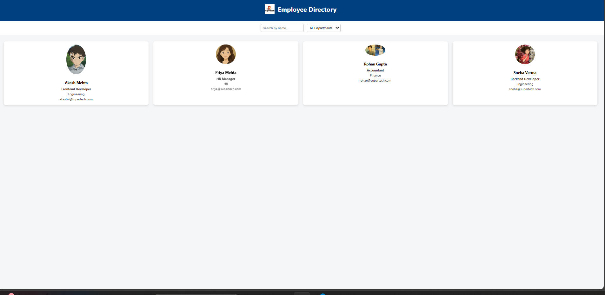

# Employee Directory Web Page

This is a simple and responsive **Employee Directory web page** created during my Web Development Internship.

## 👨‍💻 Developer Information

- **Name:** Vivek Singh  
- **College:** Sharda University  
- **Internship:** Web Development Intern 

## 📄 Project Overview

The Employee Directory web page displays a list of employees in a clean and structured layout. It is designed using **HTML**, **CSS**, and **JavaScript** to ensure responsive design and basic interactivity.

## 🛠️ Technologies Used

- **HTML5** – Page structure  
- **CSS3** – Styling and responsive layout   
- **JavaScript** – For dynamic elements like search or filters 

## 📋 Features

- Neatly organized employee cards or table layout  
- Mobile and desktop responsive design   
- Clean and minimal UI

## 📁 Project Files Structure

```
employee-directory/
├── index.html
├── style.css
├── script.js   
├── images/     
├── README.md
```

## 📷 Screenshots



## 📌 How to View

1. Download or clone the folder.
2. Open `index.html` in any web browser.

## 📄 License

This project is part of an internship assignment and is free for educational or demonstration use.
